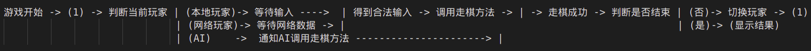

# SUSTechCS109ProjectGuide
南方科技大学CS109计算机程序设计基础期末project的一些指南

仍在持续更新中。欢迎讨论和PR。

作者QQ号是`815559068`。有问题私戳或者直接在互助群@Froster问。

## 写在前面

每学期都会看到基本所有的同学写project的时候都会在屎山里挣扎...

于是就有了这个东西。基本上是写代码需要知道，但是上课不会教你的内容。你也可以把它当作一个Q&A。

随项目还会提供一个库，里面有音乐播放器，EventCenter，可设背景图的JPanel和永远是方形的JPanel。

这篇文章的博客链接：<https://blog.froster.icu/SUSTechCS109ProjectGuide/>  
这篇文章的github链接：<https://github.com/Fros1er/SUSTechCS109ProjectGuide/>  

各位同志依据自己水平酌情观看。有些东西可能对你们过于复杂了。（我对你们的水平的分布完全没概念，非常抱歉！）

但是看不懂也不要说老师没讲，就开摆了。大伙都是靠自学过来的，只能说大学教育是这样的。。。总之遇见不懂的就思考，然后问，无论是问搜索引擎还是问我还是在互助课堂里问。如果回答的内容也不懂，接着问。使用递归学习法(乐)。

这玩意没想象中那么复杂，计算机这种东西有兴趣做的话什么都学得会。加油捏()

在开头的最后附上一句吧。
<blockquote>
"In the information age, the barriers just aren’t there," he said. "The barriers are self-imposed. If you want to set off and go develop some grand new thing, you don’t need millions of dollars of capitalization. You need enough pizza and Diet Coke to stick in your refrigerator, a cheap PC to work on, and the dedication to go through with it. We slept on floors. We waded across rivers."

By John Carmack.
</blockquote>


<!-- more -->

## 免责声明

话先说在这：
<font size=7><b>不查重！！！！！！</b></font>

~~两年四个学期~~三年五个学期里我没听说过任何一位被查重的人。更没听说过因为用了什么库被查重的人。放心。

当然如果这学期有变动或者你复制粘贴，你真被查了，别找我。

实在不放心，用什么东西前问老师或者sa。

这学期用库好像扣大分。。。这篇博客里的库放心用就行，只是一些UI上的小功能，不会扣分的。担心的话把代码copy下来自己改改。

## 答辩流程
在15或16周会有答辩。时间不会太长，老师或者sa（具体是谁查看运气，会随机分到本lab的）会对着要求让你演示一遍功能，然后你展示一下bonus，结束。基本不会看你代码。

所以你如果什么东西没写好，演示的时候避开是完全可以的（不排除老师挑一个地方指挥你演示，但总体没这么多时间）。

## 给自己打广告
~~如果你想基本不写UI几百行速通这个project.....~~

~~看看我的框架。用了就基本满分。~~

~~<https://github.com/Fros1er/2DBoardGameFrame/>~~

~~用框架是有风险的，并且也需要一定的学习和理解。做选择的时候考虑清楚。~~

我自己写了一下，发现对着样例一改只用写逻辑就可以搞定。这太imba了，估计会被本学期政策扣光光。所以欢迎借鉴...一部分。里面有很多复杂内容是为了通用性做的，有空我会更新一篇如何借鉴。

## 提问的智慧
<https://github.com/ryanhanwu/How-To-Ask-Questions-The-Smart-Way>

大概影响我一生的一篇文章。一定要读一读...

如果觉得太长不看，那就....  
<font size=5><b>记得看报错，用搜索引擎，翻聊天记录。</b></font>

## 项目管理和一些杂项
### 版本控制
如果你要进寄系，请一定在project开始前学习git。如果你不进寄系，推荐在project开始前学习git。作用详见下面的链接。

git的重要性...可以帮你们省去几个小时合代码的时间，同时在写出问题的时候知道自己动过哪里。还能给你们一分bonus。

最重要的是，它是一项基本技能，只要你们在做计算机相关的事情就一定绕不开它。

推荐阅读：[廖雪峰的git教程](https://www.liaoxuefeng.com/wiki/896043488029600/896067008724000)

### 依赖管理
如果不做bonus，可以跳过这一段。但是如果你想播放个音频，大概是绕不开别人写好的库的。

导入方法：把jar包下载到本地，然后：
1. IDEA左上角File-Project Structure  
2. 点击窗口左边的Modules，然后点击窗口偏上方的Dependencies  
3. 下面Export的上面有个+号，点击，然后选jars那个选项  
4. 选择你下载的jar包，然后**点窗口最下面的确认**  

然后你import的内容应该就不红了。

### 奇怪的问题
有时候会遇见一些代码全都变红的情况。。。尤其是把你队友的代码复制过来的时候。
提供三种解决方法。不一定有用。
1. IDEA左上角File-Open，然后确认你和你队友打开的文件夹是一样的。  
2. File-Project Structure-Project-SDK。确认一下版本是不是一样的。  
3. File-Invalidate Caches。可以解决一些玄学问题，大概率没用。  

### 如何使用搜索引擎
前面加上java swing，后面跟类名或者简略问题。比如：  
java swing JButton  
java swing listener  
java swing make jPanel square

推荐在百度以外的地方搜英文！！！！

能用谷歌用谷歌，用不了就必应国际版，不要用百度！

然后你会看到一个叫stackoverflow的网站。点就对了。CSDN里面答辩居多，少看。

# 设计

## 放弃demo
前排提醒：理解demo不一定比你从头写一个简单。demo的有些设计可能会拖累你的项目进度。而且这也是个bonus。

## 全局访问（非常重要！）
~~虽然实际的大工程不推荐这么做，但那是你工作（或者至少大三）以后的事情了。~~    
大工程好像也这么搞。狠狠地写单例和public static！

在一个游戏程序中，你的**棋盘，GUI，玩家列表，AI**等在逻辑上都有且仅有一份。而且，它们都在程序很多地方里需要。比如棋盘在GUI，行棋逻辑，AI里都会用到。比起把一个棋盘变量想办法扔来扔去，不如让它全局唯一并且可随处访问和修改。

这个方法的缺点是难以追踪变量到底是在哪里修改的，**以及需要在适当的时候重置这些变量**（比如游戏结束时清空棋盘）。逻辑清晰的话这都不是问题，如果设计得当百利而无一害。

具体做法：新建一个类，把全局变量设为public static就好。
```java
public class SomeClassname {
    public static Grid[][] yourBoard; // init elsewhere
}

// somewhere in your code...
public class ElseWhere {
    public void someMethod() {
        if (SomeClassname.yourBoard[0][0].sth) {
            //do something
        }
    }
}
```

还有一个叫**单例**的更好用的设计模式，用来获取某个类的全局唯一实例。好奇的话可以去看看。（记得抄双重锁的版本，swing是多线程）

## 使用工具类

假设你要写一个存档功能。存档自然是存棋盘。无论你是在哪里有个棋盘变量还是有个全局的棋盘，你得有个地方放存档的代码。

有些小同志就直接写按钮里了，然后队友问他存档代码在哪，他说文件A里有五分之一，文件B里有五分之二，等等等等。存档出了bug得先花上十分钟找代码在哪，令人崩溃。找到了以后发现你一个存档的代码copy了n次，你忘了一个地方导致n-1个按钮好使一个不好使，令人想去工学院天台看看。

这里的建议是写个类：
``` java
public class Saver {
    public static void save(String path) {
        ... // get board and do something to save
    }

    // load

    // everything related to save game

    private Saver() {} // 防止这个类被实例化。
}

```

然后你在十个地方有不同的存档按钮，只要在每个地方写一行`Saver.save(path);`就结束了。

工具类的意义是把在很多乱七八糟的地方重用并且功能属于一个大类的**静态**方法放在一起，这样好找也好改动。


## 游戏逻辑和界面的关系
前端是你显示出来的东西（JLabel），后端是抽象的东西（String）。swing这种古早的玩意...非常适合大伙被”怎么让这两个东西同步“折磨。即，我改了一个String怎么让对应的（可能有好几个）JLabel一块改？

另外，一定一定一定一定不要把游戏逻辑直接写在某某listener里，要不你完全没法写AI和联网对战！就算你不看我下面写的东西，你也一定要在你的listener里拿坐标啥的去调用一个单独的方法，这样你的AI和联网部分也可以做同样的事情。。

### 耦合
前后端不分离，让你的整个棋盘变成一个全局的继承JPanel的类。棋盘的每一个格子（象棋棋盘也可以是背景是十字线的格子）继承JPanel，存在棋盘类里面。格子上的棋子（继承JLabel）存在格子里面。让你的格子可以全局访问，使走棋的时候可以拿到任意格子和任意棋子在swing里对应的东西。这样，在改动格子内容时就可以不用费劲去做同步，直接操作JLabel一类的东西就好了。

游戏整体的设计大体是写一个`void moveTo(Point from, Point target) {...}`。开一个全局的临时变量存一个位置。第一次点击的时候设定这个位置(`from`)，第二次点击如果判断能走就调用`moveTo(from, pos_just_clicked)`，把棋对应的JLabel啥的挪个地（可以移过去，或者干脆删掉再在那个位置上new个新的）。如果不能，清空临时变量。结束。在这同时可以做高亮走棋位置。

这个方法简单粗暴，比用SA给的框架好写一百倍。MVC？Observer？那是什么（  

缺点也很多。比如，你走完一步棋要判断被吃的是不是将/帅，要切换玩家，要通知你的AI该走下一步棋了，还有撤回/重做，联网对战，其他UI组件的更新……这些全部被扔进了你的走棋方法里，让它变得又臭又长，牵一发而动全身。这种设计在这个体量的project下是完全可以用的，只是你和你的队友可能会配合的比较痛苦。

### 解耦
前后端分离。你的棋盘，格子，棋子类不再继承swing的组件。前端只管在某一个时候读取你只存储数据的棋盘数组，把整个可见的棋盘重新画一遍（暴力一点，反正一共也没几个格子）。如果你不想暴力，单独通知前端变动的位置当然更好。

什么时候重新画呢？看看底下的**事件系统**一节。在moveTo结束后广播一个`BoardChangeEvent`事件，让前端注册一下。

好处是，前端只需要管怎么绘制，完全不用管棋是怎么走的。后端只管发事件出去，完全不用管游戏逻辑执行完会造成什么影响。前端如果要加新功能，比如找个地方显示被吃的棋子，完全不用管后端怎么写的，只要call一下负责后端的哥们让他发棋子被吃的事件就好了。后端的哥们发事件也简单，事件只需要传递“红色的象被吃了”，象原来在哪可以完全不用管，那个是`BoardChangeEvent`管的。

然后玩家变动发playerChangeEvent，游戏结束发GameEndEvent，等等等等。前端处理起来也方便，监听不同事件绘制不同UI即可。

（总之，至少合作起来非常方便。

而且监听事件的不一定只是前端。你的AI，联网对战，甚至后端不同组件（比如玩家信息统计，成就系统）都可以用这套通信。把模块拆散特别有利于解决bug，因为当你的棋点了没反应的时候，你可以很清楚的知道是事件没发还是逻辑出了问题还是前端没渲染，问题可以很快得到定位。

### 解耦一半

我刚全说的是后端怎么通知前端。后端咋得到通知呢？

写个方法，格子被点了就调用。这里就不用写事件了，没那个必要。

你的联网对战和AI也一样可以调这个方法()

没那个必要的原因是多种输入最后通过**确定的几种方法**导向**确定的一种**结果（棋盘按规则变动。棋盘变动只能由走棋或撤回或重做导致。），而格子的变动这**一种**改变会导向**设计时不能决定的多种不相关的**结果（UI变化，联网对战的另一个客户端得到通知）。

有点抽象，希望你们看得懂吧。。看不懂一定问我，我好补充。

#### 序列化
解耦的一个额外的好处：如果你的类是独立的，只要里面所有的成员变量都可以序列化（实现了Serializable接口，原始类型，数组，Collection容器等），那就可以让java自己直接把一个实例连带当前成员变量的值写出到一个文件里，有需要的时候可以读进来变会这个实例。存档读档的时候特别方便。

<https://www.runoob.com/java/java-serialization.html>

如果你用了序列化，老师会直接给你错误存档检查的分，因为错误文件根本读不进来。（最好自己去向老师确认一下）

### 全局事件系统
前排提醒：这里说的不是Observer，是个人觉得比Observer好写一万倍的Publisher/Subscriber。强烈推荐不用demo给的Observer。

``` java
EventCenter.subscribe("event name", (e) -> {
    ExampleEvent casted = (ExampleEvent) e;
    System.out.println(casted.a);
});

// somewhere else:
EventCenter.publish("event name", new ExampleEvent(10));
/*
此时(e) -> {...} 里写的东西会被调用。
*/
```

这玩意和swing的监听器差不多。在EventCenter注册（订阅）一个函数，在事件发生时发布一个事件。此时，所有对这一事件注册过的函数都会被调用。

EventCenter的实现大概只有不到15行。直接复制粘贴成你自己的就行。

# 回调函数
既然说到了注册一个函数，那...欢迎来到异步编程的世界！（函数=方法，叫法不同罢了）

即使你不用事件系统，你也要用swing的监听器，也是异步的。所以我把这一章单独拉出来。它很重要。

你们在lab和oj里写的代码都是同步的。代码从main函数开始，从头一行接着一行执行到尾，结束。这对于UI来说完全不行。你不知道用户什么时候会点击一个按钮，所以有关这个按钮的一段代码是不知道什么时候执行的。

所以，需要转变一下思路...我们把一些代码绑定给这个按钮，让它在点击的时候调用我们给它的这些代码。这段代码有很多叫法，本文叫他“回调函数(callback)”。

回调函数和它前后的代码，无论挨的多近，都没有任何执行上的关系。你在前面写了个Integer a = 1，在回调函数里面取a的值，它可能会是任意值，因为a有可能在回调函数被实际调用之前，在别的地方被改了。你写下一个回调函数只是在“绑定”。

除了把回调函数绑定给UI以外，当然还可以把它绑定给事件。事件和UI（其实也是事件）都满足“不知道什么时候会发生，发生时需要执行一段代码”的条件。

## lambda，捕获变量，全局变量
你们肯定会在乱七八糟的地方抄到`(a, b, c) -> {...}`这个形式的代码。它叫lambda表达式。

它和这玩意完全等价：
``` java
class Lambda {
    Object x, y, z...;
    public Lambda(Object x, y, z...) {this.x = x...;}
    public call(a, b, c) {...}
}
```

call长的很像lambda本身，不用讲了。xyz是lambda捕获的变量。捕获是指：
``` java
JLabel l;
int a = 1;
button.addActionListener(e -> {
    l.setText("aaa: " + a);
    Global.b = 0;
});
l.setText("bbb");
```
你会发现lambda里面用了外面的l和a。对于实例，它拿了一份外面的引用进来以便之后用。对于基础类型，它复制了一份值进来。这个l在里面外面是互通的，就像你把ArrayList传到普通方法里面一样。

lambda的作用的话，它就是个方法。可以被写到一个变量里，等待**以后被调用**的方法。没了。

对于全局变量...你该怎么用怎么用。在哪都一样。我推荐少用捕获的变量（UI的除外），多用全局变量。

# 一轮完整的执行过程


(n)只是个标记，为了方便表达跳转回来。不代表真正的流程。

有几个点：
1. 判断当前玩家的方法应该在走棋方法的最后调用。如果不是本地玩家，应该屏蔽掉前端的一切输入。反之记得重新打开。
2. 判断玩家的方法和走棋的方法直接返回void就好。返回之后啥也不干让系统自己等下一次走棋方法触发，无论是AI还是前端还是网络。
3. 通知AI的意思是调用下面人机对战一节写的那段玩意。走棋方法在thread里面调用，通知AI的那个方法也直接返回void就好。

# 速通java swing
~~网上的教程普遍不太行...在这挖个坑。~~

## 组件
swing最主要的就三种组件：`JPanel`（容器），`JLabel`（字和图），`JButton`（按钮）。它们的共同父类是`Component`。

容器给里面装的东西一个空间并决定里面的东西如何排列(见布局管理器)，字、图、按钮、其他容器是“东西”。

所以设计UI的时候，想想哪些部分是强关联的。比如，你需要展示棋盘和游戏状态。显然这里有两个JPanel，一个是棋盘，另一个是某一个状态栏。状态栏里面有行棋方、得分等JLabel，棋盘里的每个格子是一个JPanel，格子里面是棋子的JLabel。

你的窗口是`JFrame`，里面自带一个`JPanel`。

具体有什么方法...还是得网上的教程。我写不全。

## 显示出问题了
多见于改了什么东西不立即起作用。这时只需要对有问题的组件（或者它的父组件）写下两行神奇的代码：  
``` java
component.revalidate();
component.repaint();
```

它就有极大概率起作用。

## 继承swing组件？
如果你用耦合的方法，狠狠地继承！

如果你不用，继承swing组件的唯一场合是你要用现有组件构建新组件，为它加入新功能或加限制（比如说永远是方的JPanel）。判断是不是这种情况的方法是看看你需不需要重写里面的方法。如果不需要，简单的找个地方，new一个组件，调用方法，添加进别的组件，结束。

## Listener
我刚才在回调函数一节讲过了。它们是一个东西。

有各种Listener。用的多的是：Button的`ActionListener`（按钮点击），JPanel的`MouseListener`。写`MouseListener`记得用`MouseAdapter`，开一个boolean，在按下时设为true，抬起时设为false并调用相关方法。不要用任何带clicked的东西（重点是ed这个后缀），否则会变得不幸（有几率点了没反应）。

给个示例：
``` java
panel.addMouseListener(new MouseAdapter() {
    private boolean pressed = false;
    @Override
    public void mousePressed(MouseEvent e) {
        super.mousePressed(e);
        pressed = true;
    }
    @Override
    public void mouseReleased(MouseEvent e) {
        super.mouseReleased(e);
        // your code here
    }
});
```

## JDialog
可以自定义的一个弹窗，直接往里放组件就行。

## 布局管理器
<https://blog.csdn.net/u011291072/article/details/127009177>  
常用GridLayout和BorderLayout。

建议不要把组件的宽高写死...不过你们随意，怎么方便怎么来。

**做窗口缩放的不要听信CSDN的鬼话去重写paint方法啥的，布局管理器完全够用！**  
(棋盘除外，让棋盘保持正方形建议用本博客里的库)

## CardLayout
你会需要主界面，设置界面和游戏界面在一个窗口(JFrame)里的。用CardLayout。用法自己搜。

# 如何写bonus
## 基础部分

### 打乱
`Collections.shuffle()`打乱一维数组，然后再对应到二维去。

## 人机对战
如何把AI嵌到代码里是个难点。一般来说，如果你们没有把下棋的代码全扔进Listener，而是有**一个能全局访问的函数和全局访问的棋盘**，那么就只需要在切换玩家的时候检查下一个玩家是不是AI，如果是，让AI拿棋盘计算，然后直接调用那个下棋的函数就完事了。

另一个点是怎么让AI有思考过程（延时）。我直接贴代码吧。  
``` java
Thread t = new Thread(() -> {
    try {
        Thread.sleep(1000); //1000 milliseconds
    } catch (InterruptedException e) {
        e.printStackTrace();
    }
    // your code after delay here
});
t.start();
```
这里也是个异步方法（直接叫多线程更好）。注意：在AI延时的时候所有Listener都是可以触发的（UI可以正常点）。记得屏蔽棋盘上的点击事件。

不要在没有new Thread出现的时候随便找个地方就写sleep，大概率会卡住你的整个UI！

由于这里是异步，所以Thread后的代码不要依赖thread里面的结果，这玩意的代码跑完了以后AI百分百还没落子，所以也不要依赖这个。

ab剪枝没那么好做，它是大三人工智能课上三个project之一。注意时间分配。btw，如果理解了原理，代码是可以直接抄的：<https://oi-wiki.org/search/alpha-beta/>

## 用户平台
我看project解读里写着多个frame...........it works，但真的不要这么干。

**CardLayout切换页面，JDialog弹窗。**。上学期用JDialog是个bonus。

swing的表格有一点点难用。如果不会用的话可以循环添加JLabel，然后用GridLayout布局（指分隔和换行）。

## 主题切换
可以弄个`Theme`类，里面存些图片，字体啥的。然后找个地方存个`public static Themes[] themes;`，还有`public static Theme currentTheme；`。在所有设定背景图片，设定字体的时候都用`currentTheme.picForSomewhere`来拿到对应的东西。

切换主题时，更改currentTheme为themes里的某个主题，然后直接把你的JFrame或者最上层的JPanel删了重新创建一遍。简单粗暴有用。如果这个有困难，找个文件存currentTheme的编号，然后切换主题的时候提示下次重启游戏有效。

反正你做了，虽然麻烦点，但老师不会不给你加分的。

## 音效
调我的库，谢谢。

## 可行位置提示
我猜你们会有个点击选择棋子的环节。在那个时候计算所有可行位置，然后设置那些位置的JPanel就好了。最简单的是：
``` java
panel.setBackground(java.awt.Color.YELLOW); //设个背景色
panel.setOpaque(true); //让java把panel的背景色显示出来
```

## 悔棋 & 加载棋局步骤显示
搞一个ArrayList（其实起Stack的作用，直接用Stack更好），记录每一步从哪个位置拿的子，放到了哪个地方去。如果有子被吃了，记录被吃的是什么颜色的什么子。（或者记录翻开了哪个位置，总之记录每一步做了什么）。每走一步add这些信息到arrayList末尾。

悔棋的时候取arrayList末尾的信息出来，把子从现在的位置放回去，再把被吃的子放回棋盘，删掉arrayList末尾的信息，结束。

然后你会发现，如果开局的子位置不变，按照这个ArrayList一步步推下去就可以复原整个棋局。存档里存这个ArrayList和开局的棋盘，然后读档步骤显示和回放就都有了。

步骤显示需要延时。直接拿AI那里的代码，循环放子，放完一个sleep一下。同样，要记得屏蔽玩家点击，做好玩家切换（小心AI发疯）。

## 联网对战

### Socket编程
原理不展开了，好奇的话去看<https://www.bilibili.com/video/BV1EW411u7th/?p=29>和后面的两p。

要让两个（或者多个）程序通过网络通信，需要有一个程序作为服务器接收连接，其他的程序对应的就是客户端发起连接。客户端通过ip和端口定位服务器。端口是自己设置的，不和已有端口冲突就ok。ip的话，只要所有电脑都连着校园网，通过ipconfig命令就可以拿到ip。命令怎么用自己查。

接下来就是代码环节：<https://www.cnblogs.com/yiwangzhibujian/p/7107785.html>。只看这篇的前两章你就能来回收发文本了。收到文本的时候解析一下，然后按需调用。

收发是阻塞的，记得放到线程里，和AI那块一样。

### 消息传递
每次通信发的消息...看情况吧。加入游戏的时候服务器给客户端发颜色，玩的时候服务端和客户端交换点击坐标和游戏结果什么的。能发文本的话（也可以用别的inputstream/outputstream，甚至可以序列化对象），有传什么的需求都能满足。

还记得悔棋那边写了啥不？

### 状态同步，以及独立的服务端？
状态同步指的是，两个玩家下棋的时候，每一次成功的走棋后两边的棋盘要完全一致。虽然作为一个简单的，依托 答辩的下棋游戏，偶尔出点bug不同步其实也没啥关系，重开一局就好了(乐)。

最简单的方式是不同步。客户端A改自己的棋盘，然后往B发怎么动，B收到A的指令改自己的棋盘，然后接收前端点击事件再改自己棋盘，往A发，如此反复。对于一个project来说这没有问题。

实际的游戏里会更复杂一点（不建议做这些，不同步已经够用了）。我们假定客户端是恶意的，会发错误指令。那么，客户端还是往服务端发指令，发完不改自己棋盘。服务端接收后判断指令是否合法，若不合法对客户端进行一个通知，若合法则走棋，然后返回服务端走棋后的棋盘。客户端接收棋盘后全部重绘一遍。

这种情况下，可以用任意一个客户端当服务器，也可以单独把抽象的棋盘和走棋逻辑写进单独的服务器里（不推荐），游戏开始前两个客户端分别连接服务器。后者的好处...你有空的话可以卷一个真正的联网对战平台，但是算了...我写这玩意都得写好久。

## 可执行文件打包
正统做法是exe4j。但是打成一个jar文件，然后写个.bat或者.exe用命令行执行jar也是有分的。

## 动画
用swing做真正的棋子运行动画就别想了。你的时间宝贵。（真正的万里挑一的大佬请无视这句话。个人估计，这么做就没法用Layout了，得手动绘制图像或者至少改组件坐标，超麻烦）。

有一个投机取巧的办法是GIF。真正的动画主要问题在于没法在GridLayout里让组件移到两个Grid中间，以及很难做组件在格子内的连续大小变换。但如果只是动图的话就没有这个问题了。你可以做点科幻棋子，给每个棋初始状态播一个晃来晃去的gif(正经叫idle，或者待机动画)。然后走棋的时候棋子来个传送特效GIF，目标位置也来一个。被吃了就叠一个透明爆炸GIF上去然后给下面的棋子来一个渐隐。非常炫酷！

## 计时器
抄AI那里的代码，每秒改一下JPanel显示的数字就行。

# bonus计分

在上上学期，读取存储游戏的GUI，JFileChooser选存档，用户属性（登录等），棋盘大小适应窗体缩放（用我的库谢谢喵），改棋盘图片，背景图片，鼠标划过格子或棋子有颜色变化（mouseEntered， mouseExited），计时器，这些都是有规定的bonus分的。人机不同算法拿到的bonus分也是不一样的。建议酌情去做一下。

# 五个神奇的class

**现在用库会扣分了。所以我把这几个类用的license改成了wtfpl，你们想复制随便复制，完全不需要署名！**

**记得稍微改改逻辑和变量名，否则被发现了别来怪我。**

你们从别的地方抄的大部分也都长得差不多而且九成没我这个好，所以大胆一点()

## 导入
1. ~~去 [github release](https://github.com/Fros1er/SUSTechCS109ProjectGuide/releases) 页面下载最新的jar包。~~
2. ~~IDEA左上角File-Project Structure~~
3. ~~点击窗口左边的Modules，然后点击窗口偏上方的Dependencies~~
4. ~~下面Export的上面有个+号，点击，然后选jars那个选项~~
5. ~~选择你下载的jar包，然后**点窗口最下面的确认**~~
6. ~~在需要的时候`import com.froster.utils.*`。~~

直接复制[这里](https://github.com/Fros1er/SUSTechCS109ProjectGuide/tree/main/src/main/java/com/froster/utils)的代码到自己的项目里。这样的话需要手动导入几个音乐相关的包，具体见<https://odoepner.wordpress.com/2013/07/19/play-mp3-or-ogg-using-javax-sound-sampled-mp3spi-vorbisspi/> 。

## AudioPlayer
只支持wav格式的音频播放器。有三个静态方法：  
`public static AudioPlayer playBgm(String path)`  
持续播放path（文件路径）指定的音频。播放完后会重播。

`public static AudioPlayer playSound(String path)`  
播放path指定的音频。播放完后不会重播。

`public static void stop()`  
停止播放。上面两个方法会返回一个类型为`AudioPlayer`的变量。调用它的stop方法即可停止对应的音频播放。

不推荐手动调用`AudioPlayer.play()`。它会阻塞当前线程，然后把你的程序卡住。

## GridPanel
一个布局管理器为`GridLayout`的`JPanel`，特点是里面的格子在改变大小时永远是方形。构造时需要传入宽和高各有几个格子。

## BackgroundImagePanel
一个可以设背景图的`JPanel`。构造时传入`Image`对象。

`Image`对象可以通过`Image image = ImageIO.read(new File("path/to/image"));`拿到。

上面两个Panel都可以直接替换JPanel，除了构造函数不一样没有任何副作用。

## EventCenter和Event
见上面的事件系统。

Event要单独说一下。lambda表达式里的参数e是`Event`。这个Event类是用于在事件发生时给回调函数传递信息用的，如果需要传递信息，你需要手动继承Event，在publish的时候传入你继承的类的实例，然后在lambda表达式里手动做一个强制类型转换，把它转成你实际传进去的那个类。
